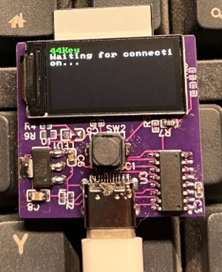

# 44Key
A simple, cheap, and somewhat secure ed25519 USB Key for SSH authentication, costs &lt; $5

Hardware: https://oshwhub.com/44670/miniusbkey

PC Software: https://github.com/44670/44KeyTool

# Key Features
- **Easy to use**: Works with SSH natively, no need for configuration of other software.
- **Cheap**: Based on ESP32C3, a highly affordable RISC-V chip. 
- **Simple**: Firmware codebase is small and auditable, only ed25519 signing is supported.
- **Secure**: Does not rely on hardware/software blackboxes (for example, Windows SmartCard API/Crypto API). Uses a dedicated USB-to-UART chip to mitigate possible vulnerabilities in the software USB protocol stack. Device itself could be encrypted for protecting keys.
- **Key management with password**: The key is generated with on-device random seed and password, the device does not store or verify one specific password. You can simply enter different password to use multiple keys.

# Getting Started
1. Prepare a compatible hardware.

Technically, any ESP32C3 boards are compatible. You may find one in affordable price in aliexpress.

Hardware design is available at: https://oshwhub.com/44670/miniusbkey , if you want to build one by yourself.

2. Compile and flash the firmware, ESP-IDF v4.4+ is required.
3. Download 44KeyTool and format your device.

Format your device with command: `44KeyTool -port [your-serial-port] -format`, You can list the serial ports on Windows Device Manager or directly run `44KeyTool` without any arguments.

Formatting the device will erase all the data on the device, and generate a new on-device random seed. You are required to enter some random text for providing more entropy.

Press the button on the device to confirm the format operation.

4. Start the SSH agent with `44KeyTool -port [your-serial-port]`, enter your password for key generation, and press the button again for confirmation. Remember you can generate multiple keys with different passwords. 
5. The SSH public key starting with `ssh-ed25519` is printed to the console. You may add the public key to `~/.ssh/authorized_keys` on your remote servers.
6. You can now use the device as an USB key for SSH authentication, while 44KeyTool is running. When you are logging in SSH, you need to press the button on the device to confirm the authentication.
7. (IMPORTANT) By default the device is not encrypted nor secure-boot protected, which allows anyone to read the on-device random-seed. To protect your key, it is highly recommended to enable **both** flash-encryption and secure-boot for the device. Please note that after enabling firmware encryption, your device will be locked and cannot be flashed with other firmware.

